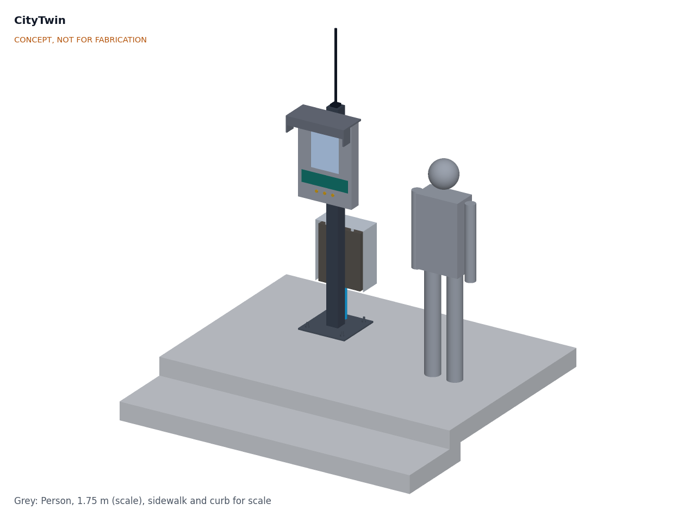
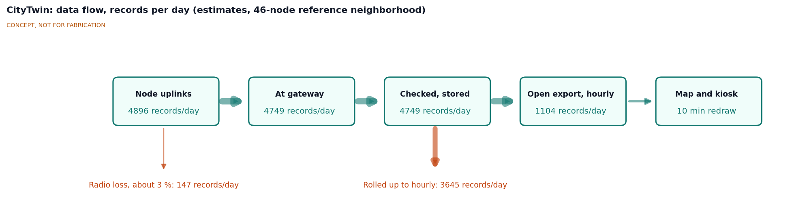
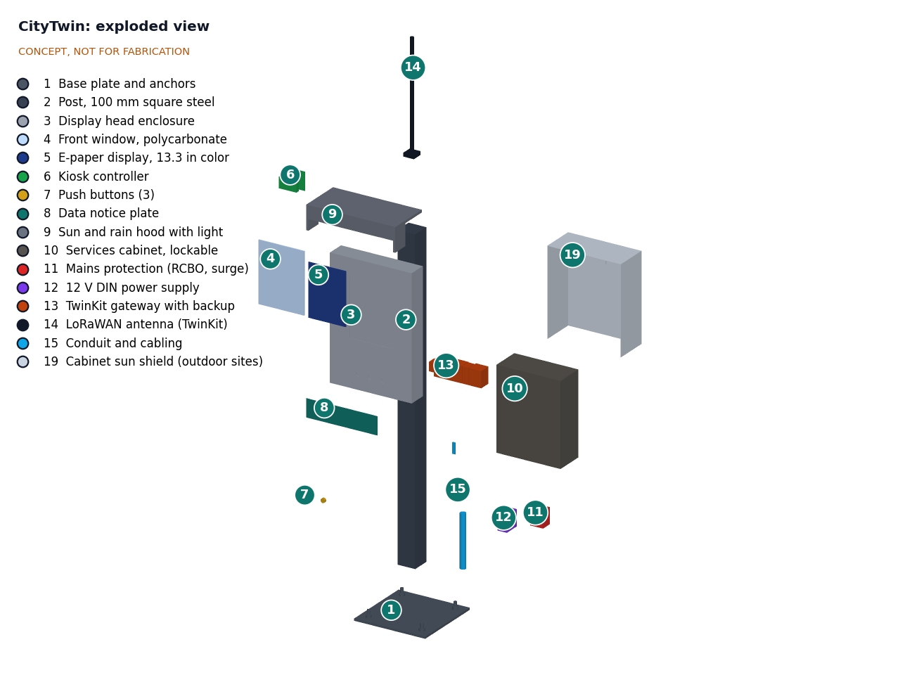
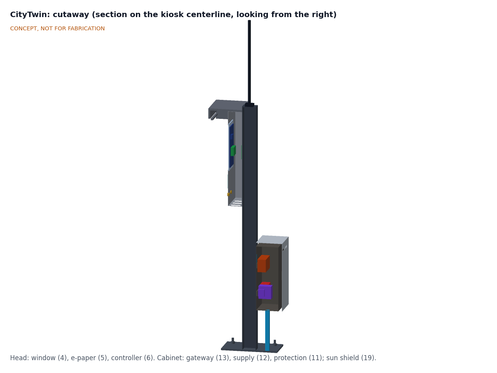

# CityTwin design precis

## Summary

CityTwin is open software that runs on a TwinKit gateway and brings the lab's smart city nodes onto one map, plus a public street kiosk that shows the same data to residents. Nodes send counts and levels over LoRaWAN; CityTwin checks every record against a schema, stores it, publishes hourly open data files and draws the map. The kiosk is a steel post with a 13.3 in color e-paper screen at eye height, three push buttons, a notice plate that says what is measured and by whom, and a locked cabinet that holds the mains protection and the gateway.

The TRL 3 calculations (CTW-CAL-001) show that the data side has wide margin: the 46-node reference neighborhood sends 5,616 uplinks a day and loses 0.61 % to collisions and downlink blanking, and the store and open export are small. The kiosk takes 9.2 W from the mains with the gateway, weighs about 60 kg with its outdoor sun shield and stands up to a 35 m/s gust with a large margin. With Amish's decisions of 2026-09-25 (CTW-DDR-002), the button LED ring acknowledges a press at once and the new layer follows in 19.8 s (R10, restated to 25 s, met on paper), the pilot kiosk costs $739.00 against the $750 budget (R16, met on paper), and the pilot range of 0 to 35 °C air leaves about 5 K of margin for the panel and the backup pack (R12, met on paper). Two requirements are not met: the TwinKit backup lasts only 1.63 h with an aged, cold pack (R18), until TwinKit fits a larger pack; and a street kiosk in sun or frost is outside the panel's 0 to 40 °C rating (R20), which is why the pilot is sited in shelter. The general arrangement is drawing [CTW-DWG-001](../cad/drawings/CTW-DWG-001.pdf).

*Figure 1. CityTwin kiosk on a sidewalk, with a 1.75 m person for scale. Rendered from the parametric model `cad/src/model.py`.*

## How it works

1. **Collect.** The seven LoRaWAN node types (CurbCount, CrossSafe, LoadZone, HeatMap Node, FloodGauge, AirStreet, NoiseMap) send small uplinks to the TwinKit gateway's concentrator. PotholeLog uploads daily road summaries over depot Wi-Fi to the fleet operator's server, and DockHub syncs over LTE-M to its own back end. Under CTW-DDR-001 D11 the gateway pulls their published aggregates (road segment files once a day, dock-hour rows every hour) by outbound HTTPS, so it still accepts no inbound connection; the path is to be agreed with those projects. CrossSafe has no LoRaWAN uplink yet (its radio links the two sides of a crossing point to point), so its layer waits for that interface.
2. **Check.** A decoder for each node type turns the payload into named fields. Any field outside that type's schema is rejected and logged, so a changed or faulty node cannot push anything but counts and levels into the store.
3. **Store.** Records go into the TwinKit time-series database with node ID, location and time. Raw records are kept for two years and hourly aggregates indefinitely (D6); ten years of aggregates and two years of raw data take about 21 GB of the gateway's card.
4. **Apply the privacy rules.** Before anything is published, people and vehicle counts below 5 per hour (D6) become "fewer than 5", PotholeLog data is published only per road segment and per day, and DockHub data only per dock per hour. No card IDs, vehicle tracks or node-level raw streams leave the gateway.
5. **Publish.** Every hour the gateway writes CSV and GeoJSON files with a documented schema and pushes them one way to a public host under CC BY 4.0 (D7), about 0.86 MB of CSV a day. An OGC SensorThings API endpoint on the public host remains a suggestion for later work.
6. **Show.** The web map has one layer per node type, a time slider, node health and an "as of" timestamp. The kiosk controller pulls a pre-rendered 1600 x 1200 image of the selected layer from the gateway every 10 min, or when a button is pressed, and writes it to the e-paper. Each image carries its timestamp, so a stale screen during an outage says so. Two controller rules follow CTW-DDR-002: a pressed button's LED ring lights within 0.5 s and stays lit until the new image is drawn, and the hood light runs dimmed to about 0.3 W from dusk.

*Figure 2. LoRaWAN data flow for the reference neighborhood, in records per day (CTW-CAL-001): 0.61 % lost to collisions and downlink blanking, and 5,582 stored records rolled up to 1,104 hourly records for the open export. PotholeLog and DockHub rows, pulled from their operators, are not shown.*

## Main components

Table 1. Main components. Numbers match `bom/bom.csv` and Figure 3.

| # | Component | Choice | Notes |
| --- | --- | --- | --- |
| 1 | Base plate and anchors | 400 x 400 x 12 mm galvanized plate, four M16 anchors on a 300 mm square | Into a footing or existing slab; 1.97 kN per anchor at the design gust |
| 2 | Post | 100 x 100 x 4 mm square hollow section, 1.75 m | Carries head, hood, cabinet and antenna |
| 3 | Display head enclosure | Folded 2 mm aluminum, about 460 x 100 x 680 mm | IP54 target, vents underneath |
| 4 | Front window | 6 mm UV-stabilized polycarbonate, anti-glare | Replaceable if scratched |
| 5 | E-paper display | 13.3 in E Ink Spectra 6, 1600 x 1200 px, about 150 px per inch | [Waveshare 13.3inch e-Paper HAT+ (E)](https://www.waveshare.com/13.3inch-e-paper-hat-plus-e.htm): about 19 s full refresh, no partial refresh, 0 to 40 °C ([manual](https://www.waveshare.com/wiki/13.3inch_e-Paper_HAT+_(E)_Manual)) |
| 6 | Kiosk controller | Raspberry Pi Zero 2 W class, wired Ethernet to the gateway | Only pulls and draws images |
| 7 | Push buttons | Three 19 mm stainless buttons with LED rings, at about 1.12 m | Layer, time range, "about this sensor" |
| 8 | Data notice plate | 400 x 100 mm, icons in the style of the open [DTPR](https://dtpr.io/) standard, QR code and short URL | Says what is measured, who is responsible and for how long data is kept |
| 9 | Sun and rain hood with light | Folded aluminum, 2 W LED strip with dusk sensor, dimmed to about 0.3 W | Shades the screen by day, lights it at night (about 219 lx) |
| 10 | Services cabinet | Lockable steel, 360 x 160 x 460 mm, IP55, two 320 mm DIN rails, door on the back | Only place with mains voltage |
| 11 | Mains protection | 6 A 30 mA RCBO and Type 2 surge protector | Installed or checked by an electrician |
| 12 | 12 V DIN power supply | 60 W, certified, SELV output | Feeds gateway and head |
| 13 | TwinKit gateway | TwinKit DIN gateway on the upper rail as in TWK-DWG-001 (294 mm of rail), LiFePO4 pack inside its UPS module | Costed in TwinKit ($290.00); runs CityTwin software |
| 14 | LoRaWAN antenna | TwinKit antenna on a post-top bracket, tip at 2.38 m, coax to the gateway's SMA bulkhead | Low for a gateway; see open questions |
| 15 | Conduit and cabling | Mains conduit into the cabinet; 12 V and Ethernet up the post | |
| 16 to 18 | Software and templates | Map dashboard, open data export, governance templates | MIT and CC licensed; no parts cost |
| 19 | Cabinet sun shield (outdoor sites) | Folded 1.5 mm aluminum over the top, both sides and the door (lift-off back panel), 25 mm air gap, open bottom, vent slots at the top | CTW-DDR-002; cuts the cabinet's rise in sun from 18.7 K to 7.2 K; not needed on the sheltered pilot site |

*Figure 3. Exploded view with BOM numbers.*

*Figure 4. Section on the kiosk centerline, looking from the right: window (4), e-paper (5) and controller (6) in the head; TwinKit gateway (13) on the upper rail, power supply (12) and mains protection (11) on the lower rail of the cabinet, under the sun shield (19).*

## Key numbers

All values are from the TRL 3 calculation note CTW-CAL-001 v0.2, which states every assumption; the tags refer to lines of its script.

Table 2. Data load for the reference neighborhood (CTW-DDR-001 D9).

| Node type | Nodes | Uplinks per node per day | Uplinks per day | Basis |
| --- | --- | --- | --- | --- |
| CurbCount | 8 | 96 | 768 | 14 B per 15 min bin (CBC-CAL-001) |
| CrossSafe | 4 | 24 | 96 | Hourly summary (CityTwin assumption; no LoRaWAN uplink defined in CrossSafe) |
| LoadZone | 12 | 124 | 1,488 | 100 state changes and 24 heartbeats, 12 B (LDZ-CAL-001) |
| HeatMap Node | 6 | 96 | 576 | 20 B per 15 min (HMN-CAL-001) |
| FloodGauge | 4 | 96 | 384 | 15 min normal mode; 1 min in events (FLG-CAL-001) |
| AirStreet | 6 | 288 | 1,728 | 20 B per 5 min (AST-CAL-001) |
| NoiseMap | 6 | 96 | 576 | 22 B per 15 min (NSM-CAL-001) |
| **Total** | **46** | | **5,616** | R2 met on paper |

Table 3. System and kiosk numbers (CTW-CAL-001).

| Quantity | Value | Requirement |
| --- | --- | --- |
| Radio airtime at SF9 | 1,309 s a day, 0.189 % of each of 8 channels | |
| Radio loss | 0.38 % collisions plus 0.23 % while the gateway sends LoadZone sign downlinks; 0.94 % plus 0.23 % in a storm peak hour | R2 met on paper |
| Gateway capacity | 14,075 records a day of 20 B at SF9 before loss reaches 1 % | R2 |
| Storage | 2.89 GB a year raw; 20.9 GB for two years raw and ten years of hourly aggregates | Fits 56 GB with TwinKit's own data |
| Open export | 7,128 rows a day, 0.86 MB CSV and 2.85 MB GeoJSON | R6 |
| Worst data age | 25.9 min on the kiosk, 15.6 min on the web map | R8 met on paper, thin margin |
| Button to new layer | LED ring in about 30 ms; layer in 19.8 s (0.79 s transfer plus 19 s refresh) | R10 (restated: 0.5 s and 25 s) met on paper |
| Text and night light | 7 mm capitals are 41 px and 16.0 arcmin at 1.5 m; about 219 lx from the hood light dimmed to 0.3 W | R9 met on paper |
| Hood shading | 13 %, 31 % and 63 % of the window shaded with the sun at 30°, 45° and 60° in front | |
| Head and panel, pilot | Panel 35.1 °C at 35 °C air in shade | R12 met on paper |
| Head and panel, street | About 79 °C in low sun and 45.1 °C in shade at 45 °C air; 13.5 W to keep an insulated panel bay at 0 °C in -20 °C air | R20 **not met** |
| Cabinet | 7.96 W inside; air 4.4 K above ambient in shade, 18.7 K in sun, 7.2 K in sun behind the sun shield; pack 5.6 K under its 45 °C charge limit at 35 °C air; with the shield the pack stays under the limit in full sun up to 37.8 °C air | R12 met on paper |
| Power | 9.2 W from the mains, 81 kWh a year; 12 V peak 26.7 W on a 60 W supply | R15 met on paper |
| Wind at 35 m/s | 827 N, 848 N·m at the base; 26.9 MPa in the post with a 1.5 factor; 1.97 kN per anchor | R13 met on paper |
| Mass | 60.1 kg with the sun shield | Two-person lift |
| Backup | 2.40 h new, 1.63 h aged at 0 °C (TwinKit); a pack of at least 1.84 Ah would give 2 h | R18 **not met** in the worst case |
| Pilot kiosk parts cost | $739.00; $769.00 with the outdoor sun shield | R16 met on paper against $750 |
| Kiosk and gateway | $1,029.00 | R17 reported |

## Key design choices

Items D1 to D11 in CTW-DDR-001 and N1 to N6 in CTW-DDR-002 are decided by Amish, 2026-09-25: go with recommendation.

- **Color e-paper rather than an LCD (D2).** E-paper is readable in direct sun, draws almost nothing between refreshes and keeps its image in an outage. A 1,000-nit outdoor LCD would respond instantly and allow touch, but costs more, draws tens of watts and needs cooling. A monochrome panel would refresh faster but lose the color layers. Decided: color e-paper for the street kiosk, with an indoor LCD variant for libraries and city hall lobbies (not modeled at TRL 3). R10 is restated for the street kiosk (LED ring within 0.5 s, layer within 25 s) and keeps 5 s for the LCD variant.
- **Sheltered pilot (D3, N5).** The panel is rated 0 to 40 °C. The pilot kiosk stands where the screen gets no direct sun, in air of 0 to 35 °C, which leaves about 5 K of margin; the heater and shading study for a street kiosk is CTW-CAL-001 section F.
- **Site rules for any outdoor kiosk (N4).** Fit the cabinet sun shield (item 19); orient the screen so it gets no direct sun (for example north-facing in the northern hemisphere) or shade it; fit the insulated, heated panel bay (13.5 W at -20 °C) only if the partner city has frost. The shield keeps the backup pack under its 45 °C charge limit in full sun up to about 37.8 °C air.
- **Buttons, not a touch screen (D8).** Three stainless buttons survive vandalism and weather and suit e-paper's slow refresh; the QR code hands richer use to the visitor's phone.
- **Gateway inside the kiosk cabinet (D4).** One site, one mains feed and one locked box for a pilot. The TwinKit gateway sits on its own DIN rail exactly as TwinKit lays it out, with a coax lead to the post-top antenna in place of its whip. The cost is a low antenna (tip at 2.38 m), which shortens LoRaWAN range; a rooftop gateway is the choice for a full neighborhood.
- **Mains power (D5).** Kiosk and gateway need 0.222 kWh a day. A solar head-only variant is kept for sites without power (not modeled at TRL 3).
- **One-way publishing and outbound pulls (D10, D11).** The gateway pushes open data files out and fetches sibling aggregates out, and accepts no inbound connections from the internet, in line with TwinKit's advice to keep the gateway off public networks until it is hardened.
- **Privacy rules in the gateway, not only in the nodes (D10).** Nodes already send counts and levels only; enforcing a schema and small-count suppression (5 per hour, D6) again at the gateway protects against a changed node or a future node type that is less careful.
- **Open data license (D7).** CC BY 4.0.
- **Budget (D1, N1).** `budget_usd` ($750, raised from $600) covers the pilot kiosk; the gateway is costed in TwinKit and the outdoor sun shield is reported separately.
- **Backup pack (N3).** TwinKit is asked for a pack of at least 1.84 Ah in cabinet installs, so the gateway rides through 2 h when the pack is aged and cold.

## Safety

> **Safety:** The services cabinet contains mains voltage (230 V or 120 V). The mains feed, RCBO, surge protector and earthing must be installed or checked by a qualified electrician and follow local electrical code. Keep the cabinet locked, fit an earth bond to the post, head and hood, and carry only 12 V SELV up to the head.

> **Safety:** The TwinKit gateway contains a LiFePO4 backup pack. Use a pack with a built-in BMS and fuse, charge it only through the TwinKit UPS module, and keep it within its temperature limits. CTW-CAL-001 finds the sealed cabinet 18.7 K above the air in full sun: at 45 °C air the pack would be near 64 °C, and in frost it cannot charge. The sun shield cuts the rise to 7.2 K but does not remove the limit above about 38 °C air. The UPS charger's 0 to 45 °C lockout must never be defeated; the pilot site must keep the cabinet out of direct sun, and any outdoor site must fit the sun shield.

> **Safety:** The kiosk is a roughly 60 kg steel post beside a walkway. Install it only with the asset owner's permission and a permit, on a footing designed for local wind and impact loads, with no sharp edges or protruding corners at head height, and keep a clear walkway width around it as local rules require. Lift it with two people or a hoist.

> **Safety:** Privacy by design: no images, audio recordings or personal identifiers are taken in, stored or published; only aggregate counts or levels. Check local data protection law, and carry out a privacy impact assessment before any deployment. CityTwin is not a public warning system: do not rely on it for flood or emergency alerts.

## Open questions

- [ ] Pull paths for PotholeLog segment files and DockHub hourly aggregates (D11): agree formats and hosts with those projects.
- [ ] A LoRaWAN uplink from CrossSafe, whose radio now runs point to point between the two sides (R1).
- [ ] Backup time (R18): TwinKit to confirm a pack of at least 1.84 Ah for cabinet installs (decided, CTW-DDR-002 N3; cross-repo action).
- [ ] Street climate (R20): the panel still exceeds its rating at 45 °C air even in shade; a wider-range panel, if one exists, remains the only full fix.
- [ ] Antenna height needed for the reference neighborhood with the gateway in the cabinet.
- [ ] Which languages and scripts the kiosk shows, and how residents ask questions or report a fault.
- [ ] First partner city or neighborhood, and co-design sessions with residents on what the kiosk should show (CTW-DDR-001 O1).

Concept media: [blueprint sheet](../media/concept-blueprint.pdf), [interactive 3D model](../media/viewer.html). General arrangement: [CTW-DWG-001](../cad/drawings/CTW-DWG-001.pdf). Calculations: [CTW-CAL-001](04-calcs/01-sizing.md).
